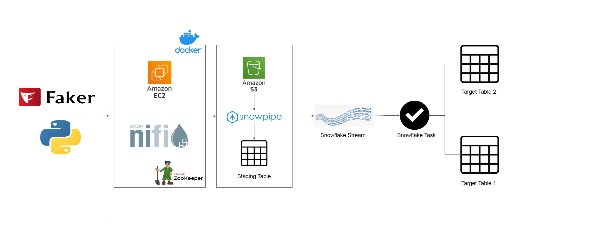

# realtime_streaming_aws_snowflake_nifi

## Project Overview

1. The project begins by generating synthetic data using the Faker Python library, providing a controlled environment for testing real-time processing capabilities.

2. The data undergoes real-time ingestion and transformation in Apache NiFi, configured to connect to the Faker data source. The processed data is efficiently written to an S3 bucket in CSV format as a staging area before moving to Snowflake.
   
3. The entire system is hosted on an AWS EC2 instance, leveraging Docker for containerization. Docker Compose orchestrates the deployment of essential components such as Zookeeper and NiFi, streamlining the setup process.

4. Snowflake, a cloud-based data warehousing platform, is integral to storing and managing processed data. Snowpipe, the data ingestion service, facilitates delta loading into the customer_raw staging table, serving as a gateway to structured data.
   
5. A Snowflake Stream is established on the production table (customer) to capture change data, crucial for implementing a Slowly Changing Dimension (SCD-2) approach. Scheduled Snowflake tasks run at one-minute intervals, automating data movement from the staging table to both the production and historical tables.

6. Automation is central to the project's efficiency. Scheduled tasks, occurring at one-minute intervals, ensure a seamless transition of data from the raw stage (customer_raw) to the production table (customer). The project incorporates Slowly Changing Dimension (SCD) methodologies, with SCD-1 (Type 1) maintaining only the latest records in the production table and SCD-2 (Type 2) capturing changes over time in the historical table (customer_historical).

### Tools Used : AWS, Docker, Snowflake, Python
